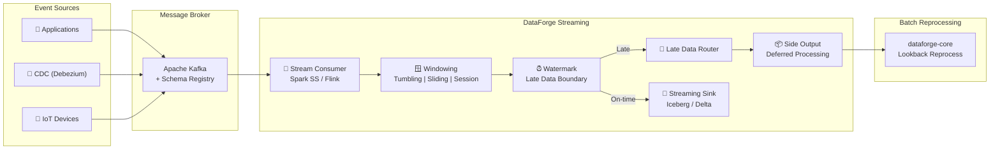

<p align="center">
  <h1 align="center">⚡ DataForge Streaming</h1>
  <p align="center">
    <strong>Real-time data processing, event-driven architecture & late data handling</strong>
  </p>
</p>

---

## Architecture



## Key Features

### 🪟 Windowed Processing
Three window types for streaming aggregations:

| Window | Use Case | Example |
|---|---|---|
| **Tumbling** | Fixed intervals, no overlap | "Count orders every 5 minutes" |
| **Sliding** | Overlapping windows | "Rolling 1-hour average, updated every minute" |
| **Session** | Activity-based gaps | "User session = events within 30 min of each other" |

### ⏰ Watermark-Based Late Data
```python
# Watermark: accept data up to 10 minutes late
watermarked = stream.withWatermark("event_time", "10 minutes")
```

**Late events beyond the watermark → Side Output → Batch Reprocessing**

### 🔄 CDC Support
Debezium-style Change Data Capture events for database change streaming.

### 📊 Event Producer
Configurable event simulator with **controllable late data injection**:
```python
producer = EventProducer(config={
    "late_data": {"enabled": True, "probability": 0.05, "max_delay_minutes": 30}
})
```

## Quick Start

```bash
# Start Kafka + Schema Registry
docker compose -f docker/docker-compose.yml up -d

# Generate test events
python -m dataforge_streaming.producers.event_producer

# Start streaming consumer
python -m dataforge_streaming.consumers.spark_consumer
```

## Part of the DataForge Platform

| Repo | Purpose |
|---|---|
| [dataforge-core](https://github.com/vipul-singhal-data/dataforge-core) | Batch processing framework |
| **dataforge-streaming** (this repo) | Real-time processing |
| [dataforge-ai](https://github.com/vipul-singhal-data/dataforge-ai) | AI/ML data engineering |
| [dataforge-analytics](https://github.com/vipul-singhal-data/dataforge-analytics) | BI & analytics |
| [dataforge-platform](https://github.com/vipul-singhal-data/dataforge-platform) | Infrastructure |

---

<p align="center">Built by <a href="https://www.linkedin.com/in/vipul-singhal-2ba042ba">Vipul Singhal</a></p>
